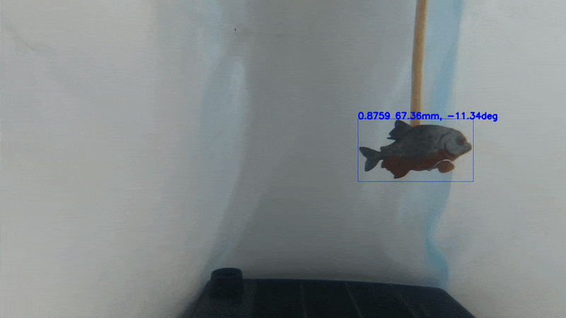

# PEMS

Este repositorio contiene el código del _Sistema Prototipo de Monitoreo Subacuático Automático de Peces por Visión Estereoscópica y Aprendizaje Profundo_. Este prototipo puede, a partir de datos de video, detectar, localizar y estimar las longitudes de los peces que se encuentran en escena de manera automática.

## Resultados

Para las pruebas en el ambiente controlado se utilizaron dos _phantoms_ de peces, un pez piraña (_Serrasalmus nattereri_) y un pez cirujano (_Paracanthurus hepatus_). Estos fueron colocados a una altura constante, en diferentes posiciones dentro del ambiente.

Para cada cuadro de video se hace la detección de los peces que puedan encontrarse en la escena, seguido del proceso de triangulación para encontrar los puntos correspondientes a la boca y la cola. Finalmente se hace un estimado de la distancia calculando la distancia euclideana entre los puntos reconstruídos.

A continuación se muestra un pequeño fragmento de la detección y estimación de ambos _phantoms_.

 

En la parte superior de la caja de detección se muestran los siguientes valores: la confianza del detector de encontrar a un pez, la longitud estimada por el sistema estereoscópico y el ángulo de inclinación respecto al plano de la imagen. Aunque se muestran ambas vistas, la información que hay en cada una es la misma.

También se pudo hacer pruebas con un pez vivo, llamado Filo, de quien se tiene el siguiente extracto:

Aquí podemos notar que no se tiene una buena iluminación, el pez no contrasta fácilmente con el fondo y existan reflejos. Todo esto no permite que el detector funcione adecuadamente. Aún así, en ciertas posiciones (como cuano el pez se encuentra horizontal a las cámaras), el detector puede hacer bien su trabajo y detectar al pez. Todavía mejor, el _PEMS_ en promedio arroja mediciones que se aproximan a la longitud real del pez, no como en el ambiente controlado, pero debemos tener en cuenta las condiciones en las que se hacen las mediciones.

Hasta aquí parece relativamente sencillo trabajar con una sola detección a la vez, pero ¿qué pasaría si tenemos más peces? El procedimiento cambia un poco, ya que debemos hacer la correspondencia de los peces detectados en ambas vistas. Utilizando geometría epipolar podemos estimar esta correspondencia y emparejar adecuadamente todas las detecciones. Un ejemplo de ello es el siguiente video presentado, donde se utilizan simultáneamente los dos _phantoms_.

<iframe width="560" height="315" src="https://www.youtube.com/embed/5LCvu4u2YsI" title="YouTube video player" frameborder="0" allow="accelerometer; autoplay; clipboard-write; encrypted-media; gyroscope; picture-in-picture" allowfullscreen></iframe>

Los resultados son prometedores, aunque todavía la detección no es perfecta y por ello las mediciones tienen errores.